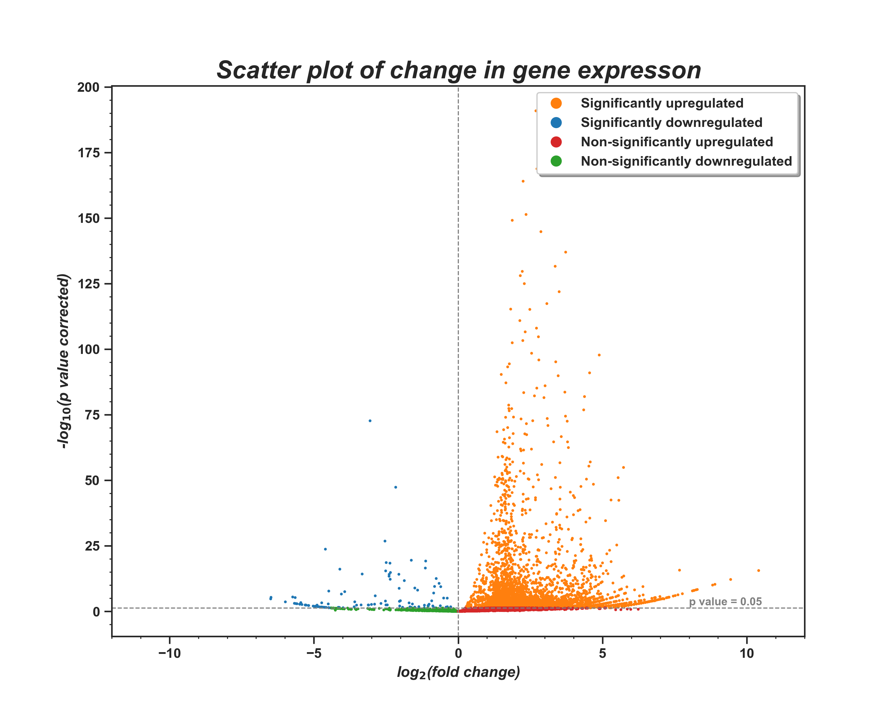

# Screening of cWnt downstream targets involved in regulation of Dynamena pumilla body axis using differential expression analysis
This repository contains research carried out during semester project in Bioinformatics Institute, spring 2024.

## Aim
Identify the entire spectrum of genes that could potentially regulate the morphological polarization of *Dynamena pumila* embryo under cWnt signaling pathway.

## Objectives
1. Perform differential expression analysis on untreated and experimental groups.
2. Identify transcripts with significant changes in expression.
3. Identify 100 transcripts with most remarkable upregulation and 100 transcripts with most remarkable downregulation in expression.
4. Reveal changes in expression for set of specific canonical Wnt signaling pathway effectors.

## Materials and methods
Samples of intact growth tips and tips treated with a cWnt activator have been sequenced by our colleagues, who also assembled transcriptomes for each sample. Reference transcriptome was assembled in our laboratory previously [1].
Transcriptomes of treated and untreated samples of were analyzed using the FastQC program with default parameters [2]. Next, we used the kallisto program [3] to pseudoalign the transcriptome of each sample to a reference and produce pseudocounts, and then the DESeq2 package [4] to analyze differential expression. Pseudocounts were normalized using the DESeq function; *D. pumila* GAPDH [5] was used as a control gene when estimating size factors. Next, we selected transcripts with significant change in expression, converted nucleotide sequencies to protein ones using Transdecoder [6] and annotated obtained sequencies using the KofamKOALA web service [7].

Project workflow with code and output files is available in the current repository inside [`code`](https://github.com/angrygeese/DynamenaProject_BI2023-24/tree/main/code) directory. To reproduce workflow first install required libraries using `requirements.txt` or `environment.yml`; there are two verions of both files, with `win` and `unix` prefixes, as research was carried out both on Windows 10 and Ubuntu 22.04. Then follow workflow described in `Lab_journal_stas_project.ipynb`. 

> **To run R/Pyton code from notebook do not forget to set working directoty in '0. Getting started' → 'Set working directory for notebook' section.  
Code presented in `%%bash` or `%%cmd` tagged cells of this notebook should be executed in system terminal from root directory of the repository.**

## Results
We identified $123445$ differentially expressed transcripts, $5196$ ($4.21$%) of them show significant change in expression (Fig. 1).
An upregulation in expression was observed for most transcripts (Fig. 1, orange and red dots) while little part showed downregulation in expression (Fig. 1, blue and green dots).

*Fig. 1* Change in gene expression after hyperactivation of cWnt signaling pathway

Selected transcripts most often corresponded to genes of members of the MAPK signaling pathway. We also found that some of the transcripts correspond to the genes of the Notch signaling pathway: Notch-family ligands and their transmembrane receptors, Delta. An upregulation in expression was observed for most transcripts ($5085$) while little part showed downregulation in expression ($101$). 
We then $100$ transcripts with an upregulation and $100$ with a downregulation in expression, converted nucleotide sequencies to protein ones using Transdecoder and annotated them using the KofamKOALA web service. Transcripts with downregulation in expression predominantly corresponded to genes of different types of collagens. They also include members of Notch signaling pathway. Among the transcripts with upregulation in expression, we identified members of cWnt pathway genes.

## References
1.	Kupaeva D., Konorov E., Kremnyov S. De novo transcriptome sequencing of the thecate colonial hydrozoan, Dynamena pumila // Mar Genomics. Elsevier, 2020. Vol. 51. P. 100726.
2.	Andrews S., others. FastQC: a quality control tool for high throughput sequence data. Babraham Bioinformatics, Babraham Institute, Cambridge, United Kingdom, 2010.
3.	Bray N.L. et al. Near-optimal probabilistic RNA-seq quantification // Nature Biotechnology 2016 34:5. Nature Publishing Group, 2016. Vol. 34, № 5. P. 525–527.
4.	Love M.I., Huber W., Anders S. Moderated estimation of fold change and dispersion for RNA-seq data with DESeq2 // Genome Biol. BioMed Central Ltd., 2014. Vol. 15, № 12. P. 1–21.
5.	Dynamena pumila glyceraldehyde 3-phosphate dehydrogenase mRNA, partial cds [Electronic resource]. URL: https://www.ncbi.nlm.nih.gov/nuccore/MK005879.1?report=genbank (accessed: 25.05.2024).
6.	Haas, BJ. https://github.com/TransDecoder/TransDecoder [Electronic resource]. URL: https://github.com/TransDecoder/TransDecoder (accessed: 25.05.2024).
7.	Aramaki T. et al. KofamKOALA: KEGG Ortholog assignment based on profile HMM and adaptive score threshold // Bioinformatics. Oxford Academic, 2020. Vol. 36, № 7. P. 2251–2252.

## Data availability
Raw data (reference transcriptome and sequencies of treated and untreated samples) available on request.

## Contacts

With any questions (including raw data request) please fell free to mail:

* Stanislav Kremnyov (s.kremnyov@gmail.com) - project supervisor
* Bredov Denis (d2707bredov@gmail.com)
